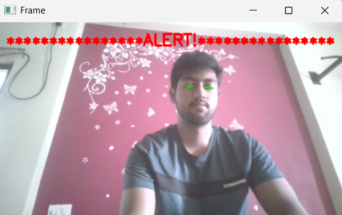

# Driver Drowsiness Detection



## Overview
Driver Drowsiness Detection is a real-time system designed to monitor driver alertness using facial landmark detection. The system calculates the Eye Aspect Ratio (EAR) to detect signs of drowsiness and triggers both visual and audio alerts to prevent accidents.

## Features
- Real-time monitoring using webcam.
- Detects drowsiness based on eye aspect ratio (EAR).
- Fullscreen visual alerts for immediate attention.
- Audio alert using Pygame for 2 seconds without freezing the video feed.
- Built with Python, OpenCV, dlib, and Pygame.

## Technologies Used
- **Python** – Core programming language.
- **OpenCV** – Video processing and GUI display.
- **dlib** – Facial landmark detection.
- **Pygame** – Audio alerts.
- **imutils** – Utility functions for image processing.

## Installation
1. Clone the repository:
   ```bash
   git clone https://github.com/pratham13103/Driver-Drowsiness-Detection.git
